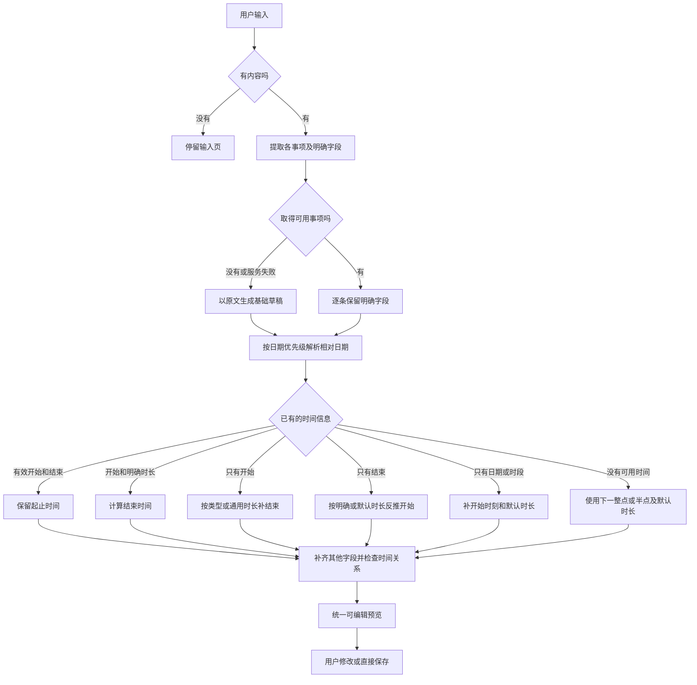

# 智能输入事件解析与信息填补规则

**设计版本：** 1.1

**更新日期：** 2026-10-04，Europe/Berlin

**状态：** 已实现、生产后端已发布，手机 Preview 89 已安装并启动；见[发布记录](./releases/2026-10-04-preview89-smart-input.md)。

本文统一规定智能输入如何把不完整的描述转换成可编辑的个人日程，供产品、代码和测试共同对照。范围包括文字输入，以及语音、图片识别后交给同一解析流程的文字；不改变双方 Plan 的提议与接受规则。

核心行为是：有内容就尽量生成草稿，保留明确信息，补齐缺失字段，统一交给用户检查和保存。本文同时维护规则和实现状态；代码验收与生产发布分别记录，不能把本地实现当作已经上线。

## 规则优先级

本文是智能输入填补规则的统一维护位置。[用户流程](./USER_FLOW.md)只描述入口和整体交互，具体默认值与分支以本文为准。用户的新决定优先于本文，修改时应同步更新规则及验收示例。

模型自行猜出的内容不等于用户明确提供的信息。模型负责提取事项和原文约束，默认日期、时刻和时长由统一程序规则补齐。

| 编号 | 规则 |
| --- | --- |
| SI-01 | 用户在预览中手动修改的值优先；随后依次采用原文明确的信息、可直接计算的信息、事件类型默认值、通用默认值。 |
| SI-02 | 信息缺失或单个字段无效，不应导致整批草稿生成失败；逐条补齐，每条仍可编辑或删除。 |
| SI-03 | 所有结果使用同一种预览。取消「需确认」「默认，可修改」、推定提醒、置信度标签及额外确认步骤；用户通过现有的预览和保存动作检查结果。 |
| SI-04 | 通用默认时长为 **30 分钟**；明确识别事件类型时采用下表的类型时长。用户明确给出的时长或有效起止时间优先。 |
| SI-05 | 一次解析使用同一个参考时刻和日历时区，日期、时间、跨天和重复规则统一计算。当前日历时区为 Europe/Berlin。 |
| SI-06 | 默认信息只用于生成草稿。用户主动保存前，不创建真实日程，也不向他人发出邀请。 |
| SI-07 | 地点、人物、课程和私人备注没有依据时留空，不编造。原始输入保留，方便用户核对和重新编辑。 |
| SI-08 | 解析服务不可用或输出无法使用时，目标是从保留的原文生成基础草稿，进入同一预览。草稿生成与保存成功分别处理，保存失败仍如实显示并保留草稿。 |
| SI-09 | 在日历时区的 00:00（含）至 04:00（不含），「明早／明天上午／明天下午」默认指当前日历日期的白天；明确日期、星期、时间间隔和「不是今天」等澄清优先。逐条解析日期，不改变整次请求的参考时刻。 |

SI-03 和 SI-04 对应用户于 2026-10-03 明确提出的修订。先前设计中的「默认一小时并提示」已被替代。已知短事务、活动及一般办事的程序规则优先于模型的粗分类，防止把没有明确类型的「办事」缩短为 15 分钟。

SI-09 为用户于 2026-10-03 确认的凌晨口语日期规则。04:00 是初版产品阈值，不代表已经判断出用户的睡眠状态。

## 信息填补树

空白输入保留在输入页，不创建空事件。对有内容但无法拆分的输入，先保留一条以原文为基础的草稿，不虚构多条事项。已成功提取的其他事项不受某一条字段缺失的影响。

## 日期和开始时间

先按下面的日期判断顺序确定实际日期，再保留明确的时段或时刻、填补缺少的部分。表中的时刻是缺省选择，不覆盖用户给出的具体时间。

### 凌晨口语日期

按 SI-05 的同一参考时刻，在 Europe/Berlin 日历时区判断是否处于凌晨窗口。对每条事项按以下顺序处理，命中后不再应用较低优先级的规则：

1. **明确表达优先。** 原文给了具体日期、星期、时间间隔，或明确说「不是今天，是明天」时，遵守这些约束。例如凌晨说「明天，也就是10月5日」，使用 10 月 5 日；「24小时以后」从真实参考时刻计算。
2. **应用凌晨口语规则。** 当本地时刻满足 `00:00 ≤ 当前时刻 < 04:00`，且表达为「明早」「明天上午」或「明天下午」，使用当前日历日期，并保留用户指定的时刻；未给具体时刻时使用下表的时段默认值。
3. **其余按自然日解释。** 04:00 起恢复通常的「明天 = 下一日」。此规则仅覆盖上述中文表达；「明天晚上」「后天」「下周」及其他语言表达仍按既有自然日规则处理，不整体前移。

例如当前是 10 月 4 日 00:30，「明天上午10点取充电线」生成 10 月 4 日 10:00 的草稿。它只影响该事项的日期解析，不把系统时间改成 10 月 3 日，也不影响同一句里另一个明确日期的事项。

遵守 SI-03：不显示跨午夜提醒、推定标签或额外确认步骤。普通预览直接展示最终的具体日期、星期和时间，例如「10月4日 周日 10:00」，不能只用「明天」代替实际日期。

### 开始时刻填补

| 已有信息 | 填补规则 |
| --- | --- |
| 日期和具体时刻 | 保留，包括用户明确指定的过去时间。 |
| 只有具体时刻 | 今天该时刻尚未过去则选今天，否则选明天。 |
| 只有未来日期 | 默认该日 09:00。 |
| 只有今天这个日期 | 09:00 尚未过去则使用 09:00，否则使用当前时刻之后的下一整点或半点。 |
| 日期和时段 | 上午 09:00、中午 12:00、下午 14:00、晚上 19:00；保留指定日期。 |
| 只有时段 | 按上述时段选具体时刻，再按「只有具体时刻」确定日期。 |
| 日期和时间都没有或均无法解析 | 使用当前时刻之后的下一整点或半点。 |
| 明确的过去日期，但没有时刻 | 使用该日 09:00，不擅自移动到未来。 |
| 日期有效但时刻无效 | 保留日期，按该日期缺少时刻的规则补齐。 |

「下一整点或半点」严格晚于参考时刻，例如 14:12 → 14:30，14:30 → 15:00，23:50 → 次日 00:00。日期和时段均已明确时，不为了避免过去时间而覆盖原文，例如傍晚输入「今天上午取件」仍保留今天上午。

只有结束时刻时，先按同样的日期规则确定结束日期，再反推开始；不先补一个无关的开始时间。跨天时同步更新日期，夏令时切换按日历时区处理。

## 时长与结束时间

| 事件类型 | 默认时长 |
| --- | --- |
| 明确的短事务，例如取充电线、取快递、还书 | 15 分钟 |
| 未知类型、一般办事及其余未列出的类型 | **30 分钟** |
| 吃饭、会议、学习、运动 | 60 分钟 |

事件类型须来自事项含义。无法明确归类时使用 30 分钟，不让模型自由猜测其他默认时长。类型表与日历分类是两个概念，不能仅凭 Personal 或 Study 分类决定时长。

| 已有信息或冲突 | 处理规则 |
| --- | --- |
| 有效开始和结束 | 保留；若另外给出的时长与之矛盾，以明确的起止时间为准。 |
| 开始和明确时长 | 结束 = 开始 + 时长。 |
| 结束和明确时长 | 开始 = 结束 − 时长。 |
| 只有开始 | 按事件类型选择默认时长，计算结束。 |
| 只有结束 | 按事件类型选择默认时长，反推开始。 |
| 只有时长 | 按日期和开始时间规则补开始，保留明确时长。 |
| 没有结束时间或结束格式无效 | 保留可用开始，使用明确时长或类型默认时长补结束。 |
| 原文明确跨夜，例如「晚上十点到凌晨一点」 | 结束放在次日，不把它当成时间倒置。 |
| 结束不晚于开始，且没有可确定的跨夜含义 | 保留开始，使用明确的正时长或类型默认时长重新计算结束。 |

上述补齐与冲突处理均不产生个别事项的提示标签。结束时间应为完整日期时间，默认时长按实际分钟计算，不能仅拼接小时数。

## 其他字段

| 字段或情况 | 处理规则 |
| --- | --- |
| 标题 | 从原文提取简短事项；无法提取时使用原文片段。标题遵守字段长度限制，完整原文保留在输入内容中。 |
| 地点、人物、备注 | 有明确依据才填写，否则留空；不自动添加联系人或共享参与者。 |
| 日历分类 | 能映射到现有用户分类才填写，否则暂不分类。 |
| 没有重复要求 | 不重复。 |
| 明确重复，但未写截止日期 | 使用「永不结束」，按普通重复设置展示。 |
| 「每周」但未写星期 | 使用首次草稿日期对应的星期。 |
| 重复表达无法确定，例如「隔几天」 | 先生成一次日程，保留原文，用户可在预览中修改重复设置。 |
| 多条事项 | 每条独立补齐；完整事项不因另一条缺少字段而被丢弃。 |

现有单次最多十条草稿、输入和图片大小限制继续适用；超出输入限制时保留原文供编辑，不默默截断后宣称完整识别。

## 验收示例

EX-01 至 EX-13 统一使用 **2026-10-03 14:12，Europe/Berlin** 作为参考时刻；凌晨示例另列各自的参考时刻。它们描述目标行为，不代表已经通过的测试。所有案例均使用普通预览，不显示 SI-03 取消的提示。

| 编号 | 输入或条件 | 期望草稿 |
| --- | --- | --- |
| EX-01 | 明天上午10:00取充电线 | 取充电线，10 月 4 日 10:00–10:15。 |
| EX-02 | 明天取充电线 | 取充电线，10 月 4 日 09:00–09:15。 |
| EX-03 | 取充电线 | 取充电线，10 月 3 日 14:30–14:45。 |
| EX-04 | 明天10点办事 | 办事，10 月 4 日 10:00–10:30。 |
| EX-05 | 明天学习两小时 | 学习，10 月 4 日 09:00–11:00。 |
| EX-06 | 明天11点结束开会 | 开会，10 月 4 日 10:00–11:00。 |
| EX-07 | 明天10点取充电线，留半小时 | 取充电线，10 月 4 日 10:00–10:30；明确时长覆盖短事务默认值。 |
| EX-08 | 今天23:50办事 | 办事，10 月 3 日 23:50 至 10 月 4 日 00:20。 |
| EX-09 | 今天晚上十点到凌晨一点学习 | 学习，10 月 3 日 22:00 至 10 月 4 日 01:00。 |
| EX-10 | 每周三学习 | 学习，10 月 7 日 09:00–10:00，每周三重复，无截止日期。 |
| EX-11 | 明天10点取充电线；下午3点开会一小时 | 两条草稿分别补齐；无效结束字段不导致另一条丢失。 |
| EX-12 | 输入「办事」，但模型服务不可用 | 基础草稿「办事」，10 月 3 日 14:30–15:00；不伪造识别成功或保存成功状态。 |
| EX-13 | 用户把 EX-01 的结束时间改成 10:20 | 保存 10:20，不重新套用默认时长。 |

以下参考时刻均为 **2026 年，Europe/Berlin**；验收时固定日期与时区，不使用执行测试当下的时间。

| 编号 | 参考时刻 | 输入 | 期望日期和时间 |
| --- | --- | --- | --- |
| EX-14 | 10 月 4 日 00:30 | 明天上午10点取充电线 | 10 月 4 日 10:00–10:15。 |
| EX-15 | 10 月 4 日 00:30 | 明天下午3点开会 | 10 月 4 日 15:00–16:00。 |
| EX-16 | 10 月 4 日 00:30 | 明早取充电线 | 10 月 4 日 09:00–09:15。 |
| EX-17 | 10 月 4 日 00:30 | 明天，也就是10月5日，上午10点取充电线 | 10 月 5 日 10:00–10:15，具体日期优先。 |
| EX-18 | 10 月 4 日 00:30 | 不是今天，是明天上午10点取充电线 | 10 月 5 日 10:00–10:15，明确澄清优先。 |
| EX-19 | 10 月 4 日 00:30 | 24小时以后提醒我办事 | 10 月 5 日 00:30 开始，不改写时间间隔。 |
| EX-20 | 10 月 4 日 00:00 | 明天上午10点取充电线 | 10 月 4 日 10:00–10:15，00:00 已进入口语窗口。 |
| EX-21 | 10 月 4 日 03:59 | 明天上午10点取充电线 | 10 月 4 日 10:00–10:15，仍在口语窗口。 |
| EX-22 | 10 月 4 日 04:00 | 明天上午10点取充电线 | 10 月 5 日 10:00–10:15，04:00 已退出口语窗口。 |
| EX-23 | 10 月 4 日 00:30 | 明天晚上7点开会 | 10 月 5 日 19:00–20:00，该表达不在本规则范围内。 |
| EX-24 | 10 月 4 日 00:30 | 明天周一上午10点取充电线 | 10 月 5 日周一 10:00–10:15，明确星期优先。 |

回归还应覆盖：模型漏字段、空值、无效结束时间、开始与结束相同、跨月跨年、夏令时，以及不同设备时区下相同日历时区的结果一致。

## 当前实现与验收状态

本节包含 2026-10-03 的本地验收及 2026-10-04 的生产／手机发布结果。

| 部分 | 当前状态 |
| --- | --- |
| [统一策略](../lib/calendar/smart-input-policy.ts) | 实现日期、时段、默认时长、结束时刻反推、跨日、逐项修复及 SI-09；不用于保存阶段。柏林春季不存在的时刻向后平移一个夏令时差，秋季重复时刻选第一次。 |
| [共享默认值](../lib/calendar/CalendarSmartInputPolicy.json) | 服务端直接导入，Xcode 将同一文件打包为原生资源；通用 30 分钟、短事务 15 分钟、活动 60 分钟只在此定义。 |
| [模型提取](../lib/calendar/parse-natural-language.ts)与[字段结构](../lib/calendar/natural-language-schema.ts) | 区分日期、开始时刻、结束时刻和时长；字段携带原文片段。缺失、无效字段逐项补齐，模型不填默认值，返回 `warnings: []` 保持 API 兼容。 |
| 凌晨口语日期 | 程序按单条原文处理 00:00–04:00 窗口，明确日期、星期、时间间隔及澄清优先。已覆盖 EX-14 至 EX-24。 |
| [原生预览](../ios-native/SideSeat/Features/Calendar/CalendarSmartAddView.swift) | 移除推定提示；具体日期、星期和时间按柏林时区展示，跨日结束另显示结束日期。编辑后的时间原样交给保存接口。 |
| [失败后的基础草稿](../ios-native/SideSeat/Features/Calendar/CalendarSmartAddStore.swift) | 模型不可用时服务端使用本地规则；网络不可用或响应无法解码时，手机保留完整原文，以原文标题、下一半点及类型时长生成一条基础草稿。手机离线基础草稿不声称完成语义识别。登录问题仍使用登录流程，保存失败如实显示且保留草稿。 |
| [规则测试](../tests/calendar/natural-language-schema.test.ts) | 固定参考时间覆盖 EX-01 至 EX-24，并覆盖缺失/无效字段、UTC/柏林/洛杉矶运行环境、跨月跨年和夏令时。 |
| [API 验收](../e2e/api-v1-calendar.spec.ts) | 独立本地数据库验证生成预览不写日程、取充电线默认 15 分钟、用户改为 20 分钟后实际保存 20 分钟、批量保存幂等。 |
| 原生验收 | 12 项相关单元测试、2 项预览/编辑/保存界面测试及深色最大字号复测通过；中文分组预览截图已检查，无推定提示。UI 使用 fixture，不能作为真实模型或真机证据。 |
| 生产环境 | 已发布 `dpl_56ce6g2JaUMRuQMCbofBftrMMq1s`；候选及正式域名分别通过两位临时 QA 账号的真实模型、凌晨日期、15/30 分钟默认和手改 20 分钟保存检查。Preview 89 已签名、安装、版本回读并启动。完整手机手动交互未作本轮验收；见[发布证据](./releases/2026-10-04-preview89-smart-input.md)。 |

## 防止规则漂移

1. 修改行为时，在同一变更中更新本文对应的 SI 规则、EX 示例、代码和测试。若仍处于设计阶段，只更新文档，并明确保留实现差异。
2. 默认时间、时长和冲突处理应集中在一处程序策略中；提示词、客户端和文档中的示例都以它对应的规则为依据，避免各自维护不同默认值。
3. 自动化测试引用相关 SI 或 EX 编号，并用固定参考时间和时区检查结果。除解析测试外，验证草稿可编辑、修改不会被默认值覆盖、保存前无写入。
4. 发布前核对本文与实际行为；存在差异时写入本节，不能只改文档状态为「已实现」。部署和验收证据记录在 `docs/releases/`，本文只维护当前规则与实施差异。

上述测试已接入 `npm run test:calendar:parser`。修改规则时仍需同步维护本文及相应测试；文档本身不会自动检查语义一致性。
