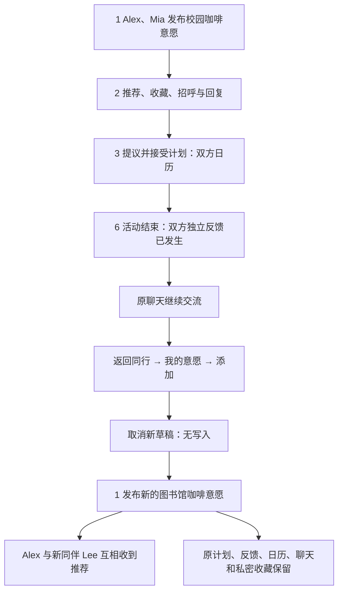

# 1 → 2 → 3 → 6 → 1：完成活动后重新发布意愿

日期：2026-10-03，Europe/Berlin。基线为已安装 Preview 86 对应的原生代码，Git 起点 `cc56a1b`。本轮主闭环使用真实原生 App、本地 API 和三个独立 QA 账号。

## 结论

**主闭环通过。** Alex 与 Mia 从意愿、推荐、招呼与回复到第一次计划及双方日历，分别反馈活动发生后，Alex 发布新的图书馆咖啡意愿，成功与新同伴 Lee 进入下一轮推荐。Alex 与 Mia 的旧聊天、第一次计划、日历和反馈都保留；新推荐没有自动创建聊天、计划或日历。

发现 1 个可直接修复的文案问题，以及 1 个需要产品设计的回流问题。当前阶段已完成测绘；小问题修复与手机交付结果将在后续阶段补记。

## 路径测绘

本轮止于新意愿及下一轮推荐，未向新同伴发送招呼或创建第二个计划；这正是与第一闭环 `6 → 3` 的差别。

| 阶段 | 实际验证 | 证据 |
| --- | --- | --- |
| 1 → 2 | 两条意愿由 App 发布；Mia 收藏并发送招呼；Alex 回复后进入同一聊天 | [推荐](evidence/2026-10-03-new-intent-loop/closed-loop-02-recommendation.png)、[回复后的聊天](evidence/2026-10-03-new-intent-loop/closed-loop-05-replied-chat.png) |
| 2 → 3 | 意愿上下文带入标题，明确时间、发送、对方接受；双方日历有记录 | [已确认](evidence/2026-10-03-new-intent-loop/closed-loop-08-plan-confirmed.png)、[独立数据核验](evidence/2026-10-03-new-intent-loop/first-plan-state.json) |
| 3 → 6 | 仅压缩第一次计划和两条日历的时间；双方分别通过 UI 提交 Happened | [Alex 反馈](evidence/2026-10-03-new-intent-loop/closed-loop-new-intent-11-outcome-loopqa_a.png)、[Mia 反馈](evidence/2026-10-03-new-intent-loop/closed-loop-new-intent-11-outcome-loopqa_b.png) |
| 6：原联系 | 双方在原聊天发送活动后消息；后续重新打开仍可读 | [活动后聊天](evidence/2026-10-03-new-intent-loop/closed-loop-new-intent-12-old-chat-loopqa_b.png) |
| 6 → 1：草稿 | 新入口打开空白活动说明、时间待定；填写后取消，重新打开没有残留 | [空白草稿](evidence/2026-10-03-new-intent-loop/closed-loop-new-intent-14-blank-draft.png)、[取消后旧聊天](evidence/2026-10-03-new-intent-loop/closed-loop-new-intent-15-history-after-cancel.png) |
| 1：重新发布 | Lee、Alex 各自发布新意愿；Alex 重登后仍有新意愿 | [新意愿](evidence/2026-10-03-new-intent-loop/closed-loop-new-intent-16-new-publication.png)、[重登](evidence/2026-10-03-new-intent-loop/closed-loop-new-intent-20-reloaded-publication.png) |
| 下一轮发现 | Alex 推荐页出现 Lee，没有重新推荐已结束意愿的 Mia；Lee 也收到 Alex | [Alex 的推荐](evidence/2026-10-03-new-intent-loop/closed-loop-new-intent-17-new-company.png)、[Lee 的推荐](evidence/2026-10-03-new-intent-loop/closed-loop-new-intent-19-new-peer-recommendation.png) |
| 旧关系与隐私 | Alex 看不到 Mia 的私密收藏；Mia 仍能从原收藏打开旧聊天 | [收藏回原聊天](evidence/2026-10-03-new-intent-loop/closed-loop-new-intent-21-saved-history-chat.png) |

## 小问题：返场用户仍被称为第一次发布

完成一次同行后，原意愿已结束，当前意愿列表为空。界面却显示 **Add your first intention／添加第一个意愿**，容易让用户以为历史已丢失。[复现截图](evidence/2026-10-03-new-intent-loop/closed-loop-new-intent-13-return-to-intentions.png)。

拟直接改为 **Add an intention／添加意愿**，复用现有中英德翻译。无需增加“是否首次使用”的服务器字段，也无需改变意愿生命周期。

## 已记录、暂不改动：P2，反馈后缺少寻找新同伴的明确入口

[已反馈的计划卡片](evidence/2026-10-03-new-intent-loop/closed-loop-new-intent-11-outcome-loopqa_a.png)只强调 **Plan again／再约一次**，其含义是给原同伴发新计划。想走 `6 → 1` 的用户需要自行理解并返回 **同行 → 我的意愿 → 添加**。

同时，已被确认计划消费的原意愿是 `ENDED`，不会显示在“我的意愿”的过期历史里；新草稿需要重新填写活动。旧上下文仍在原聊天，并非数据丢失。不能为了补入口就把所有 ENDED 意愿重新显示，因为主动删除的意愿也使用该状态。

**影响：** 功能可走通，回流引导不足，用户难以区分“继续约这个人”和“发新意愿找其他同行”。这涉及入口层级、草稿继承和历史意愿的含义，因此按要求记录，未自行扩展改造。

**后续设计方向：** 考虑在已结束计划处并列一个低强调的“寻找新的同行”，进入独立的新意愿草稿；明确活动是否预填、时间需重新确认。发布前不匹配、不发送消息，不覆盖原计划或带入原同伴。需要连同“再约一次”的主次关系统一设计。

## 数据落地

[独立 Prisma 最终断言](evidence/2026-10-03-new-intent-loop/final-state.json)通过：

| 数据 | 结果 |
| --- | --- |
| 意愿 | 4 条：原 Alex/Mia 2 条 ENDED，内容保留；新 Alex/Lee 2 条 ACTIVE |
| 新时间 | 两条新意愿均为待定时间，没有继承第一次计划的过期日期 |
| 推荐机会 | 2 条：原机会与新机会 ID、来源意愿和同伴均独立 |
| 聊天 | 仅原来的 1 条 ACTIVE；新推荐未创建聊天 |
| 计划及日历 | 仍为第一次 1 个已接受计划、双方 2 条日历；没有重复记录 |
| 活动反馈 | 原计划 2 条 OCCURRED，1 条共同经历 |
| 取消草稿 | 未产生第三种标题的意愿、推荐或计划 |
| 私密收藏及消息 | Mia 的收藏不向 Alex 展示；原招呼、回复及两条活动后消息各保存一次 |

## 验证结果与边界

- 最终 4 个真实 API 原生 UI 方法通过，0 跳过：[阶段一](evidence/2026-10-03-new-intent-loop/phase1-summary.json)、[活动反馈](evidence/2026-10-03-new-intent-loop/phase2-initial-summary.json)、[取消与重新发布](evidence/2026-10-03-new-intent-loop/phase3-summary.json)。
- 活动反馈与取消草稿的首次组合运行是 **1 通过、1 失败**：新测试误把可选活动说明当作必填，要求空说明的发布按钮禁用。现有已交付行为允许只选活动类别发布。更正测试为检查未继承旧内容、时间待定，保留真正的取消与数据断言；重跑通过，没有改动产品校验以迁就测试。
- iPhone 13 mini 模拟器，iOS 26.5；英语浅色、普通字号，真实 Development App。本次采用当前的社交开关，包括 `v2MeetAgain=true`；没有填写再次同行许可，仍能发布新意愿找新同伴。
- API 运行于活跃工作区 `127.0.0.1:3033`；隔离库 `sideseat_new_intent_20261003`，147 个迁移。只预置 3 个完整测试账号。除进入活动后反馈阶段而修改第一次计划和日历的时间外，业务写入由 App 操作完成。
- 本地库包含工作区已有的资料迁移；本次没有修改、部署这些资料或日历后台工作。原生产品源码起点与 Preview 86 一致，[源文件记录](evidence/2026-10-03-new-intent-loop/baseline-tested-source.json)。
- 本轮未用真实用户、未写正式数据库；APNs 关闭。不能以本地编译/请求耗时判断正式消息时延；未覆盖两台真机推送、断网恢复或真实线下活动。

复现：`scripts/qa-new-intent-loop.ts` 的 `seed → UI 01 → check-plan → advance → UI 02 → UI 03 → UI 04 → verify`。只可对新的空隔离库 seed；不要重跑已写入的反馈或发布阶段。相关 UI 方法在 `SocialLiveUITests` 的 `testClosedLoop01…` 和 `testNewIntentLoop02/03/04…`。完整 xcresult 位于本机 `/tmp/sideseat-new-intent-phase{1,2,3}-20261003.xcresult`。
