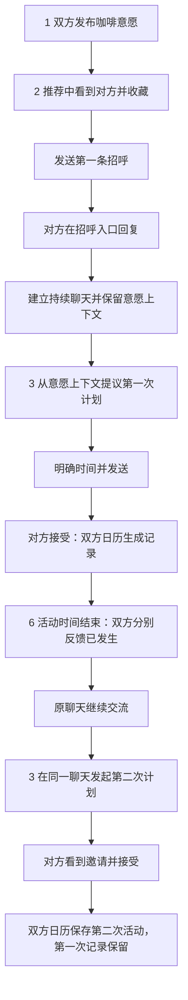
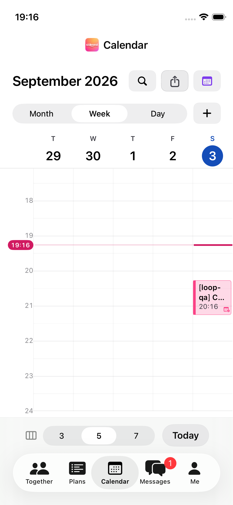
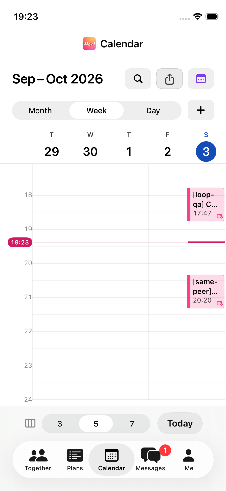

# 1 → 2 → 3 → 6 → 3：与同一个人再次约定计划

测试日期：2026-10-03，Europe/Berlin。范围：第一个闭环；第二个 `1 → 2 → 3 → 6 → 1` 尚未测试。

## 结论

**本地原生 App 主流程通过。** 两位用户从发布意愿、收到推荐、打招呼和回复，到接受第一次计划、各自反馈活动发生，再在原聊天中发起并接受第二次计划，最终双方日历都保存了两次活动。第二次邀约没有重新匹配、创建新聊天或覆盖第一次计划。

直接修复 1 个小问题：周日历跨月时标题只显示起始月份。另记录 2 个需要产品设计的体验问题：活动反馈后缺少明确的再次邀约入口；聊天顶部仍把最初意愿显示为“计划”，容易与最新计划混淆。两者均未阻断此次测试，但会增加用户理解和操作的负担。

最终 4 项真实 API 原生 UI 测试及 24 项日历单元测试通过，0 跳过；独立数据库核验通过。本次属于本地验证，修复尚未安装到手机上的 Preview 85，也没有发布正式后端。

## 实际走通的流程



这里的“6 → 3”由用户主动进入原聊天、点击计划按钮完成。反馈并不会自动创建或发送下一次邀约；本次走了双方都反馈的路径，也不意味着双方反馈是再次提议计划的必要条件。

| 阶段 | 实际入口与操作 | 验证结果与证据 |
| --- | --- | --- |
| 1：意愿 | A、B 分别在同行 → 意愿发布咖啡活动，时间暂未确定 | 两条意愿由原生 UI 创建；[意愿页](evidence/2026-10-03-same-peer-loop/closed-loop-01-intention.png) |
| 1 → 2：发现 | B 打开推荐，收藏 A 的匹配结果，再进入收藏页 | 收藏后推荐仍保留，收藏状态变更；[推荐](evidence/2026-10-03-same-peer-loop/closed-loop-02-recommendation.png)、[收藏](evidence/2026-10-03-same-peer-loop/closed-loop-03-saved.png) |
| 2：招呼 | B 从推荐发第一条消息，A 从消息 → 招呼入口打开并回复 | 第一条消息处于招呼流程，回复后进入持续聊天；历史招呼和回复各保存一次；[招呼](evidence/2026-10-03-same-peer-loop/closed-loop-04-first-message.png)、[回复后的聊天](evidence/2026-10-03-same-peer-loop/closed-loop-05-replied-chat.png) |
| 2 → 3：第一次提议 | A 打开聊天顶部意愿上下文并创建计划 | 自动带入活动标题；未明确时间前无法发送，确认时间后可发送；[意愿上下文](evidence/2026-10-03-same-peer-loop/closed-loop-06-intention-in-chat.png)、[计划表单](evidence/2026-10-03-same-peer-loop/closed-loop-07-plan-proposal.png) |
| 3：第一次接受 | B 在原聊天接受，随后双方各自查看日历 | 同一计划进入两人日历；源意愿转为 ENDED；[已确认](evidence/2026-10-03-same-peer-loop/closed-loop-08-plan-confirmed.png)、[B 的日历](evidence/2026-10-03-same-peer-loop/closed-loop-09-calendar-mia.png)、[数据库](evidence/2026-10-03-same-peer-loop/first-plan-state.txt) |
| 3 → 6：活动结束 | 测试脚本把已接受活动的时间移到过去，A、B 分别在计划 → 已结束点击 Happened | 两份反馈均由 UI 提交；数据库有两份 OCCURRED 及一份共同经历记录；[A 的反馈](evidence/2026-10-03-same-peer-loop/closed-loop-same-peer-11-outcome-loopqa_a.png)、[B 的反馈](evidence/2026-10-03-same-peer-loop/closed-loop-same-peer-11-outcome-loopqa_b.png) |
| 6：继续联系 | 双方分别回到原聊天发送活动后消息 | 聊天可继续，两条新消息各保存一次；[聊天](evidence/2026-10-03-same-peer-loop/closed-loop-same-peer-12-continued-chat-loopqa_b.png) |
| 6 → 3：再次提议 | A 在原聊天点计划按钮，填写第二次活动并发送 | 产生独立的 PENDING 计划；尚未接受时没有生成新日历记录，原两条记录保留；[再次提议](evidence/2026-10-03-same-peer-loop/closed-loop-same-peer-13-second-plan-draft.png)、[待接受状态核验](evidence/2026-10-03-same-peer-loop/second-plan-pending.txt) |
| 3：再次接受 | B 在计划总览看到邀请，回原聊天接受 | 新邀请可见并成功接受；[总览](evidence/2026-10-03-same-peer-loop/closed-loop-same-peer-15-second-invitation-overview.png)、[接受后](evidence/2026-10-03-same-peer-loop/closed-loop-same-peer-16-second-plan-accepted.png) |
| 闭环落地 | B 查看日历；重新登录 A 查看日历和原聊天 | 两人均有第二次活动；重新打开聊天后无需手动滚动即可看到新计划；[B 日历](evidence/2026-10-03-same-peer-loop/closed-loop-same-peer-17-calendar-mia.png)、[A 日历](evidence/2026-10-03-same-peer-loop/closed-loop-same-peer-18-calendar-alex.png)、[重开聊天](evidence/2026-10-03-same-peer-loop/closed-loop-same-peer-21-reopened-latest-plan.png) |
| 历史入口补查 | 点击已结束计划卡片 → 原聊天 → 计划按钮 | 可以打开新计划表单；取消后未创建第三个计划；[表单](evidence/2026-10-03-same-peer-loop/closed-loop-same-peer-20-ended-plan-repeat-entry.png) |

## 已修复：跨月日历标题误导

**复现：** 周视图展示 9 月 29 日至 10 月 3 日，当前计划在 10 月 3 日，但顶部只写 `September 2026`。用户容易怀疑自己停在错误月份。

**修改：** 标题按可见日期范围生成；同月仍显示完整月份，跨月显示两个覆盖月份，跨年保留两年的信息，并使用当前语言的日期格式。此次实测显示为 `Sep–Oct 2026`。

| 修改前 | 修改后 |
| --- | --- |
|  |  |

修改位于 [HomeWeekWindow.swift](../../ios-native/SideSeat/Features/Home/HomeWeekWindow.swift) 和 [HomeRootView.swift](../../ios-native/SideSeat/Features/Home/HomeRootView.swift)。[HomeWeekWindowTests.swift](../../ios-native/SideSeatTests/HomeWeekWindowTests.swift) 新增跨月英文、同月中文、跨年德文三种断言；整个相关单元测试套件 24 项通过。原生第二次接受和日历展示在修复后的构建上通过。

## 已记录、暂未改动的体验问题

后续已按[修复设计方案](2026-10-03-same-peer-loop-remediation-design.md)实施并完成主要原生回归，见[实施与验证报告](2026-10-03-same-peer-loop-remediation.md)。以下保留首次测绘时的问题和证据。

### P2：反馈完成后缺少明确的“再约一次”入口

反馈后的已结束卡片显示 Happened 和编辑按钮，用户需要自己推断“点整张卡片进入聊天，再点左下角计划按钮”，或从消息页找到对方。新表单不会自动沿用上一次活动标题。

证据：[反馈完成](evidence/2026-10-03-same-peer-loop/closed-loop-same-peer-11-outcome-loopqa_a.png)、[从历史计划打开的新表单](evidence/2026-10-03-same-peer-loop/closed-loop-same-peer-20-ended-plan-repeat-entry.png)。本次环境的 `V2_MEET_AGAIN_ENABLED=0`，未把关闭的功能当成已经可用的入口。

**影响：** 系统能完成 `6 → 3`，但界面没有清楚告诉用户下一步。这是此闭环最值得优先处理的体验问题。

**建议方向：** 反馈完成后提供“再约 TA”，打开同一个人的新计划草稿，可带入活动与地点，要求重新选择未来时间并主动发送。需要决定入口位置、是否推荐重复活动、如何与“寻找新同伴”并列，因此本次先记录，没有扩展修改回流设计。

### P2：聊天顶部把旧来源显示为“计划”，与最新计划混淆

第二次计划已经确认，顶部仍显示 `Plan / [loop-qa] Campus coffee`，而下面最新卡片是 `[same-peer] Coffee again`。[重开聊天截图](evidence/2026-10-03-same-peer-loop/closed-loop-same-peer-21-reopened-latest-plan.png) 同时显示了这两个标题。

**原因：** [ConversationContextSelection](../../ios-native/SideSeat/Features/Chat/DirectChatInfoView.swift) 从有 origin 的消息取上下文。普通聊天发起的第二次计划没有原意愿 origin，因此顶部继续使用第一次的来源快照，并把类型标为 Plan。

**影响：** 用户可能把顶部理解为当前计划；这次核验确认两次活动的数据是分开的，第二次接受和日历保存没有受影响。

**建议方向：** 明确区分“最初相识的意愿”和“当前待办／最近的计划”，再决定顶部主展示哪个。此处涉及多计划聊天的信息层级，未直接用最新标题覆盖历史来源。

### 补查后未认定为产品故障：聊天定位

阶段三的一张即时截图还停在较旧内容，因此额外加入“重开聊天后最新计划必须可见”的有界等待断言。独立运行通过，最终截图能看到第二次已确认计划。没有据此修改聊天滚动逻辑，也没有把即时截图误报为无法看到新计划。

## 数据核验

核验来自独立 Prisma 查询，不依赖截图上的成功文案。见[最终状态](evidence/2026-10-03-same-peer-loop/final-state.txt)。

| 对象 | 闭环结束时的实际状态 |
| --- | --- |
| 原意愿 | 2 条，均 ENDED；再次邀约没有发布新意愿 |
| 推荐机会 | 1 条；没有第二轮匹配 |
| 聊天连接 | 1 条 ACTIVE，第二次计划复用同一 connection |
| 计划 | 2 条不同 ID，均 ACCEPTED；第二条不是第一条的修改或反提案 |
| 日历 | 4 条：每次计划分别对应两位参与者；第二次记录与计划时间一致 |
| 第一次反馈 | 双方各 1 条 OCCURRED，共同经历记录 1 条 |
| 第二次反馈 | 0 条；未来活动没有被误标成已发生 |
| 消息 | 招呼、回复、双方活动后消息均在原聊天中各保存 1 次 |

第二次 PENDING 阶段另行核验了“0 条新日历记录 + 保留第一次的 2 条记录”，因此没有出现发送邀请就替对方占用日程的情况。

## 测试环境与证据边界

- 活跃工作区：`/Users/baichu/Desktop/项目/app开发项目/Sideseat-ios-uxui`；保留 `codex/ios-uxui-20260922` 及既有未提交工作。原生产品源码起点与 Preview 85 相同，见[起点比对](evidence/2026-10-03-same-peer-loop/source-baseline.json)。
- iPhone 13 mini 模拟器，iOS 26.5；真实原生 Development App，英语、浅色、普通字体；依次登录两个独立 QA 账号。没有使用静态聊天或计划 mock。
- 真实本地 Next API（127.0.0.1:3033）和隔离 PostgreSQL 数据库 `sideseat_same_peer_20261003`，147 个迁移应用于空库。脚本只预置两个完整测试账号；意愿、招呼、回复、计划接受和反馈均通过 App 操作产生。
- 为进入“活动结束”阶段，仅把第一次已接受计划及两条日历投影的起止时间移到过去，见[时间压缩记录](evidence/2026-10-03-same-peer-loop/time-compression.txt)。没有直接写入反馈或共同经历。本次验证了过期后回流，不代表真实线下见面或自然等待整段活动时间。
- 本地 API 会话共记录 325 个请求，包含前期测试脚本重试，均未出现 HTTP 4xx/5xx；见[请求汇总](evidence/2026-10-03-same-peer-loop/api-request-summary.json)。开发编译耗时不用于推断正式环境的消息延迟。
- APNs 关闭；未覆盖两台实体手机同时在线、正式环境通知和消息时延、断网恢复、中文完整路径、深色及最大字号。本报告不能作为这些项目或正式发布的验收结论。
- 本轮本地 API 和数据库进程已停止，隔离测试数据和证据保留；已撤回 Next 自动生成的临时构建目录配置变动。

## 自动化结果与复现位置

| 项目 | 最终结果 | 证据 |
| --- | --- | --- |
| 发布 → 推荐／收藏 → 招呼／回复 → 第一次计划及双方日历 | 1 通过，0 跳过 | [阶段一](evidence/2026-10-03-same-peer-loop/phase-1-summary.json) |
| 双方活动反馈 → 原聊天继续联系 → 第二次提议 | 1 通过，0 跳过 | [阶段二](evidence/2026-10-03-same-peer-loop/phase-2-summary.json) |
| 第二次接受／双方日历／历史回流 + 日历单元测试 | 1 UI + 24 单元通过，0 跳过 | [阶段三](evidence/2026-10-03-same-peer-loop/phase-3-summary.json) |
| 重新打开聊天，最新计划可见 | 1 通过，0 跳过 | [阶段四](evidence/2026-10-03-same-peer-loop/phase-4-summary.json) |
| TypeScript 类型检查、QA 脚本定向 ESLint、本轮修改的 diff 检查 | 通过 | 本机 `/tmp/sideseat-same-peer-types-20261003.log`、`/tmp/sideseat-same-peer-lint-20261003.log` |

测试代码：[LiveLoginSmokeUITests.swift](../../ios-native/SideSeatUITests/LiveLoginSmokeUITests.swift) 中 `testClosedLoop01IntentBookmarkGreetingPlanAndCalendars`、`testSamePeerLoop02OutcomesAndSecondPlanInOriginalChat`、`testSamePeerLoop03AcceptSecondPlanAndCalendars`、`testSamePeerLoop04ReopenConversationShowsLatestPlan`。

数据库准备和核验代码：[qa-same-peer-loop.ts](../../scripts/qa-same-peer-loop.ts)。在新建隔离库且本地 API 已启动的条件下，顺序为 `seed → UI 01 → check-first → advance → UI 02 → check-second-pending → UI 03 → UI 04 → verify`。脚本对主机及库名有断言，不能指向正式数据库；不要对已经保存两次计划的本次库重新 seed。

成功运行的完整 xcresult 保留于本机：

```text
/tmp/sideseat-same-peer-phase1-r3-20261003.xcresult
/tmp/sideseat-same-peer-phase2-r2-20261003.xcresult
/tmp/sideseat-same-peer-phase3-20261003.xcresult
/tmp/sideseat-same-peer-phase4-20261003.xcresult
```

有用的执行条件：`SIDESEAT_LIVE_UI_TESTS=1`、`SIDESEAT_LIVE_API_BASE_URL=http://127.0.0.1:3033`，`xcodebuild test` 使用 `SideSeat-Development / Development`，独立 DerivedData 与结果目录，串行执行上述方法。[实际测试源码哈希](evidence/2026-10-03-same-peer-loop/tested-source-hashes.json)用于区分既有工作与本轮修复。

前期测试工具问题已处理：旧测试仍期待“收藏后卡片立即消失”，已改为检查保存状态；聊天页面出现早于历史消息返回，已改用有界等待；复用旧构建目录的首轮出现旧断言，后续改用全新 DerivedData；一次不存在的 xctestrun 路径未能启动测试，改回正常 `xcodebuild test`。这些失败没有计为产品故障，最终结果也没有靠跳过断言获得。

## 后续范围

第一闭环的功能与数据链路已在上述条件下验证完成。两个体验问题保留在本报告，下一阶段可先决定“6 → 3”的入口和聊天上下文展示，再测试第二闭环 `1 → 2 → 3 → 6 → 1`：活动结束后发布新意愿、进入下一次发现。
